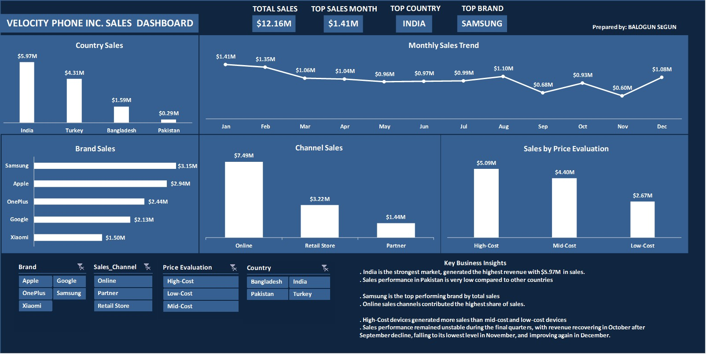
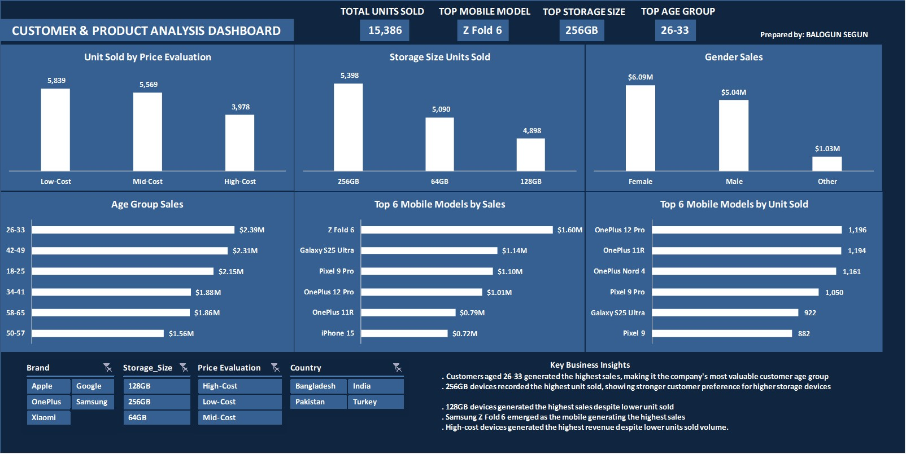

# Mobile Phone Sales Analysis

Excel-based sales analysis for Velocity Phone Inc., covering sales performance, customer behavior, product performance, market activity, sales channels, pricing, and customer demographics.

## Dashboard Preview

### Dashboard 1 — Sales Performance

### Dashboard 2 — Customer & Product Analysis

## Tools Used
- **Microsoft Excel:** Data cleaning, PivotTables, PivotCharts, Slicers, KPI analysis, and interactive dashboard design
- **Microsoft Word:** Detailed business analysis and case study reporting
- **Microsoft PowerPoint:** Project presentation

## Repository Structure
- `/workbook/` - Excel workbook containing the cleaned data, PivotTables, calculations, and dashboards
- `/dashboard/` - Final dashboard previews
- `/report/` - Detailed project report
- `/presentation/` - Project presentation slides

## Key Insights & Recommendations

### 1. Market & Sales Performance
- **Insight:** India and Turkey generated the highest sales, with India contributing the largest share.
- **Recommendation:** Strengthen marketing and inventory allocation in high-performing markets while developing targeted strategies for lower-performing markets.

### 2. Product & Pricing Performance
- **Insight:** Premium devices generated higher revenue, while more affordable models recorded higher purchase volume. Samsung premium models were major revenue contributors.
- **Recommendation:** Maintain a balanced product strategy covering both premium high-revenue devices and affordable high-volume products.

### 3. Customer & Channel Performance
- **Insight:** Online sales represented the strongest sales channel, while customers aged 26–33 and female customers contributed strongly to sales.
- **Recommendation:** Strengthen digital sales strategies and use customer demographics to support more targeted marketing campaigns.

### 4. Sales & Inventory Planning
- **Insight:** Sales performance varied across months, while 256GB devices recorded the highest unit sales.
- **Recommendation:** Align inventory and promotional strategies with demand patterns and expand competitively priced devices with higher-demand storage options.

## Project Deliverables
- Cleaned Excel dataset
- Two interactive Excel dashboards
- Detailed business analysis report
- Project presentation
- Business insights and recommendations

---

**Project:** Mobile Phone Sales Analysis — Velocity Phone Inc.  
**Dataset:** 2024 mobile phone sales transaction data  
**Raw Records:** 366  
**Valid Records After Cleaning:** 303  
**Dashboards:** 2
